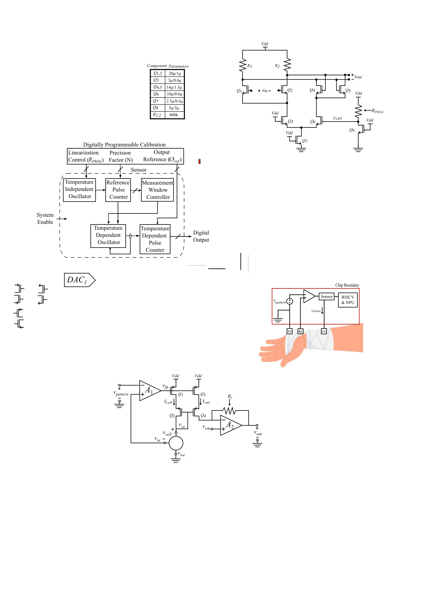
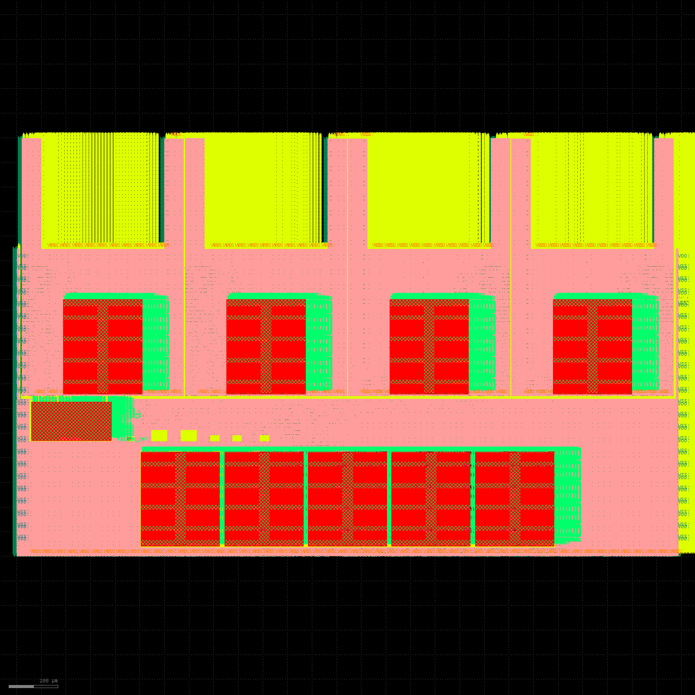

<table border="0" cellspacing="0" cellpadding="0">
  <tr>
    <td>
      
      
    </td>
    <td style="padding-left:12px;">
      <h1 style="margin:0;">VestaRV - A Custom RISC-V Core &amp; SoC Family</h1>
    </td>
  </tr>
</table>

[](https://github.com/maxxseminario/VestaRV/actions/workflows/docs.yml)
[](LICENSE)

**VestaRV is a from-scratch 32-bit RISC-V processor and a family of chips built around it.**
One CPU core — written from the ground up against the official RISC-V ISA specification,
never derived from any existing implementation — anchors three taped-out and tapeout-ready
SoCs and a config-driven chip generator that turns a single Python description into RTL,
C headers, linker scripts, and a full Technical Reference Manual.

- **The core** — VestaRV: a multicycle **RV32IMAC + Zb\*** (Zba/Zbb/Zbc/Zbs) machine with a
  fast hardware multiplier, multi-cycle divider, compressed-instruction split-fetch, a
  machine-mode CSR unit, and a distinctive **stack-based recursive interrupt controller**.
- **The chips** — one core, three silicon products:
  - **[Myshkin](implementations/asic/myshkin-2025-11/README.md)** — single-core mixed-signal
    SoC, **taped out to TSMC 65 nm in November 2025**, silicon validated March 2026. Its
    potentiostat design won a **best paper award at IEEE ISCAS 2026**.
  - **[Castalia](implementations/asic/castalia/README.md)** — a **4-hart** multiprocessor
    derived from the same core: private TCM per hart, an arbitrated shared-memory window
    (CLINT, hardware mutexes, PLIC-style interrupt router), signoff-closed tile and MCU.
  - **[Argus](implementations/asic/argus/README.md)** — an **18-hart** teaching chip built
    from the identical hart tile as a 3×3 tile array, generated from one JSON config.
- **The generator** — [`platform/common/`](platform/common/README.md) is the single source
  of truth. `make chip CONFIG=…` regenerates everything for a configuration — drop-in RTL
  (`MCU.vhd` + `MemoryMap.vhd`), C headers, linker scripts, and a ~160-page config-driven
  TRM — and `make verify` **proves the configuration boots** by staging the generated RTL
  into a behavioral simulation and running the multi-core boot/ISA smoke suite.

<p align="center">
  <br>
  <em>Myshkin single-core die — the first VestaRV silicon, with annotated blocks.</em>
</p>

<p align="center">
  <br>
  <em>Castalia 4-hart MCU assembly — four identical hart tiles plus the shared bulk-RAM bank row.</em>
</p>

### Technical Reference Manuals

Each chip ships a complete, config-driven TRM (peripheral register reference, memory map,
system architecture, programming guide):

- 📄 **[Myshkin TRM](implementations/asic/myshkin-2025-11/docs/TRM.pdf)** — single-core, TSMC 65 nm tape-out (Nov 2025)
- 📄 **[Castalia TRM](implementations/asic/castalia/docs/TRM.pdf)** — 4-hart multiprocessor
- 📄 **[Argus TRM](implementations/asic/argus/docs/TRM.pdf)** — 18-hart teaching chip

### Explore

The interactive documentation site (hosted on GitHub Pages; the same pages render from the
repo view via relative links):

- 🌐 **[Documentation site](docs/index.html)** — landing page and figures (served at the site root on GitHub Pages)
- 🛠️ **[Chip configurator](docs/chip_configurator.html)** — build a config in the browser, with live derived-geometry math and pad-ring/block diagrams
- 🗺️ **[Development roadmap](docs/vestarv_roadmap.html)** — the full milestone timeline

---

**Namesake:**  
VestaRV is named after **Vesta**, the Roman goddess of hearth, home, and the eternal flame. As Vesta's fire symbolized the heart of the household, VestaRV is designed to be the heart of your embedded system—providing reliability and a strong foundation for your MCU and SoC projects.

**Typical Applications:**
- Custom embedded MCU development
- Mixed-signal and sensor interfacing
- Multi-core / parallel embedded compute
- ASIC/SoC integration
- Low-power IoT devices

---

## The Chip Generator

VestaRV's flagship differentiator is that its chips are **generated, not hand-wired**. A
single Python description (`platform/common/python/generate.py`) is the source of truth for
the memory map, every peripheral register and bit field, the GPIO/package pinout, and the
documentation. From it, `make chip` emits:

| Output | Description |
|--------|-------------|
| **Drop-in RTL** | `out/hdl/MCU.vhd` + `MemoryMap.vhd`, byte-identical to the live `hdl/common/` tree (verified by `check_mcu_vhd.py`) |
| **C headers** | `MemoryMap.h` and peripheral definitions for firmware |
| **Linker scripts** | Memory layout matched to the configured RAM/ROM/TCM sizes |
| **TRM PDF** | ~160-page Technical Reference Manual — feature list, chapters, memory map, hart/vector counts all config-driven |

The configuration is a small JSON document (`make chip CONFIG=config.json`); every key is
optional and missing keys keep the Castalia defaults. Knobs include hart count, memory
sizes, ISA extensions, and individually droppable peripherals. `make verify [CONFIG=…]`
then **proves** the configuration boots — it stages the generated RTL into an Xcelium
behavioral flow and runs the multi-core boot/ISA smoke suite against it.

Both **Castalia (4-hart)** and **Argus (18-hart)** are produced from this one source by
changing config knobs — the hart tile is identical between them.

---

## Repository Layout

Since the 2026-07 hierarchy restructure, each top-level HDL/tool tree is split into one
directory per VestaRV instantiation (`myshkin/` = the frozen single-core tape-out;
`common/` = the shared multi-core Castalia/Argus tree):

### Core Hardware
- **`hdl/`** — VestaRV core and MCU peripheral VHDL sources
  - `hdl/common/` — shared multi-core tile RTL (Castalia + Argus derive from this)
  - `hdl/myshkin/` — **frozen** single-core Myshkin tape-out RTL (do not touch)
  - `hdl/argus/` — frozen 18-hart Argus RTL snapshot

### Platform / Chip Generator
- **`platform/`** — the config-driven toolchain/RTL/TRM generator
  - `platform/common/` — the Castalia/Argus generator (see [`platform/common/README.md`](platform/common/README.md))
  - `platform/myshkin/` — **frozen** single-core Myshkin generator

### Firmware & Software
- **`software/`** — embedded firmware projects (bootrom, `rv4th` Forth, example apps, HAL) — see [`software/README.md`](software/README.md)

### Verification
- **`verification/`** — RISC-V ISA tests (adapted from [riscv-tests](https://github.com/riscv-software-src/riscv-tests)), benchmarks, and the test environment

### Tools & Build System
- **`tools/`** — RISC-V toolchain/build system (`tools/build/`), programmers, and debug utilities — see [`tools/build/README.md`](tools/build/README.md)

### Implementations
- **`implementations/`** — per-chip documentation and configuration (ASIC + FPGA) — see [`implementations/README.md`](implementations/README.md)

### Assets
- **`assets/`** — logos, diagrams, and documentation images

---

## Core Specifications

- **ISA:** RV32I Base + **M** (multiply/divide), **A** (atomics: LR/SC + AMO), **C** (compressed), and **Zb\*** (ZBA, ZBB, ZBC, ZBS bit-manipulation); ZICNTR partial
- **Interrupts:** Stack-based recursive interrupt handling; on multi-core chips, a PLIC-style claim/complete interrupt router with any-vector-to-any-hart routing
- **Multi-core:** Identical hart tiles behind a serializing round-robin arbiter; globally coherent atomics across the shared window; CLINT + hardware mutex bank for synchronization
- **Verification:** Full RV32UI/UM/UA/UC ISA suite plus multi-core boot/sh tests; post-physical (gate-level) verified

---

## Quick Start

```bash
git clone https://github.com/maxxseminario/VestaRV.git
cd VestaRV
```

**1. Generate a chip (RTL + headers + linker scripts + TRM) from one config:**
```bash
cd platform/common
make chip                    # regenerate the default (Castalia) configuration
make chip CONFIG=config.json # apply a JSON config (see the chip configurator)
make verify                  # PROVE the configuration boots (needs Cadence + RISC-V toolchain)
```
See [`platform/common/README.md`](platform/common/README.md) for the full knob list and flow.

**2. Build firmware:**
```bash
cd software/bootrom
make all
```
See [`software/README.md`](software/README.md) for the firmware build system and examples.

**3. Run verification:**
```bash
cd verification/isa
make rv32ui
```
See [`verification/isa/README.md`](verification/isa/README.md) for the test suites and
[`hdl/README.md`](hdl/README.md) for VHDL simulation setup.

---

## Author and Support

**Author:**  
_Maxx Seminario_    
PhD Student, Integrated Circuit Design  
Analog, Mixed-Signal, and System-on-Chip Design  
University of Nebraska-Lincoln    
Email: mseminario2@huskers.unl.edu  

If you need access, support, or have questions about VestaRV or its MCU subsystem, please reach out directly to the author via email. 

---

## License

VestaRV is released under the **MIT License**. See [`LICENSE`](LICENSE) for full details.
