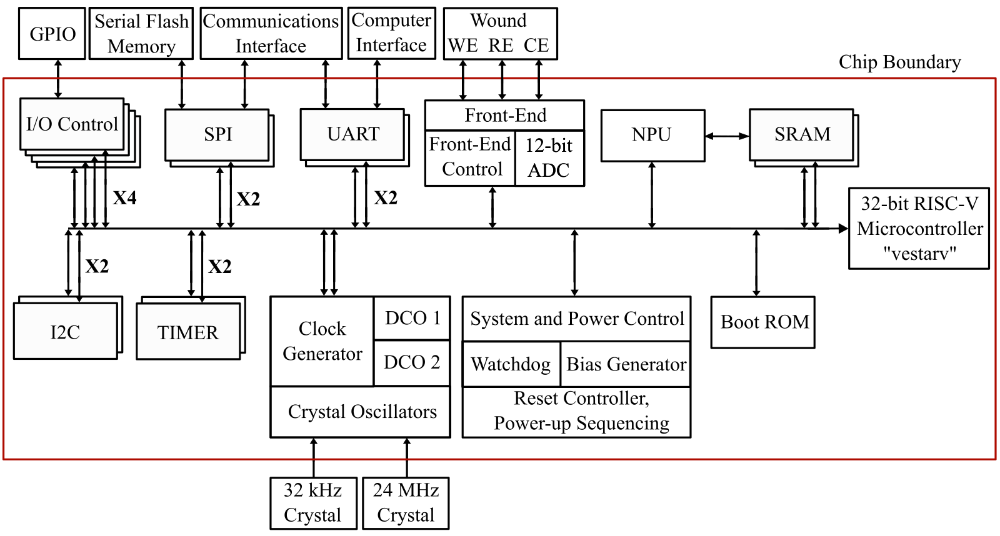

<table border="0" cellspacing="0" cellpadding="0">
  <tr>
    <td>
      
      
    </td>
    <td style="padding-left:12px;">
      <h1 style="margin:0;">VestaRV - A Custom RISC-V Core &amp; SoC</h1>
    </td>
  </tr>
</table>

VestaRV is a custom 32-bit RISC-V processor core designed as an independent personal project, built from the ground up using the official RISC-V instruction set specification without deriving from any existing core implementations. The core supports **RV32I base ISA** with **M** (multiply/divide), **C** (compressed), **A** (atomic), and **Zb*** (bit manipulation) extensions, and features **stack-based recursive interrupt handling**. This repository provides both the VestaRV core and a configurable MCU System on Chip (SoC) implementation, enabling rapid integration into embedded systems and ASIC designs.

> 📄 **[MCU User Guide — v1.0.0 (Myshkin)](implementations/asic/myshkin-2025-11/docs/MCU-User-Guide.pdf)**  
> Complete peripheral register reference, system architecture, and programming guide for the Myshkin SoC — the first VestaRV tape-out (TSMC 65nm, November 2025).

**Namesake:**  
VestaRV is named after **Vesta**, the Roman goddess of hearth, home, and the eternal flame. As Vesta's fire symbolized the heart of the household, VestaRV is designed to be the heart of your embedded system—providing reliability and a strong foundation for your MCU and SoC projects.

**Typical Applications:**
- Custom embedded MCU development
- Mixed-signal and sensor interfacing
- ASIC/SoC integration
- Low-power IoT devices


---

## Example MCU Configuration

Below is an example MCU-level block diagram showing one possible instantiation of VestaRV with various peripherals:



*Note: VestaRV is designed to be highly configurable. The peripheral set, memory architecture, and system features can be customized to match your specific application requirements.*

---

This repository is organized into the following directories:

### Core Hardware
- **`hardware/`** — VestaRV core and MCU peripheral VHDL sources
  - `MCU/vesta/` — RISC-V processor core implementation
  - `MCU/periph/` — Peripheral modules (GPIO, UART, SPI, Timer, etc.)
  - `MCU/tb/` — Testbenches for simulation

### Firmware & Software
- **`software/`** — Embedded firmware projects
  - `bootrom/` — Boot ROM code and Forth interpreter
  - `rv4th/` — Standalone Forth interpreter

### Platform Definition
- **`platform/`** — Automated toolchain generation system
  - Generates C headers, linker scripts, documentation from single source
  - Run `cd platform && make` or see [`platform/README.md`](platform/README.md)
  - Single Python script defines entire memory map and peripherals
  
### Verification
- **`verification/`** — Test suites and verification infrastructure
  - `isa/` — RISC-V instruction-level tests (adapted from [riscv-tests](https://github.com/riscv-software-src/riscv-tests))
    - Organized into `tests/` (source) and `build/` (artifacts)
    - Central `rcf/` directory for VHDL simulation files
  - `benchmarks/` — Performance benchmarking tests
  - `env/` — Test environment and linker scripts

### Tools & Build System
- **`tools/`** — Development tools and build infrastructure
  - `build/` — Build system and linker scripts
  - `debug/` — GDB server and debugging utilities
  - See [`tools/build/README.md`](tools/build/README.md) for toolchain setup

### Implementations
- **`implementations/`** — ASIC and FPGA instantiations of VestaRV
  - `asic/` — ASIC tape-out documentation and configurations
  - `fpga/` — FPGA board implementations
  - See [`implementations/README.md`](implementations/README.md) for structure details

### Assets
- **`assets/`** — Logos, diagrams, and documentation images


---

## Core Specifications

- **ISA:** RV32I Base + M, C, A, ZBA, ZBB, ZBC, ZBS, ZICNTR (partial)
- **Interrupts:** Stack-based recursive interrupt handling
- **Verification:** Post-physical verified
- **Extensions:** Bit manipulation, atomic ops, compressed, and multiply/divide instructions

---

## Example Peripheral Configuration

The following peripherals are included in the example configuration shown above. VestaRV's modular design allows you to select and configure peripherals based on your application needs:

- **System Control**
  - Clock multiplexing and dividing
  - Digitally Controlled Oscillators (DCO)
  - Watchdog Timer (WDT)
  - CRC calculation engine
  - Power gating for ROM/RAM blocks
- **Compute Accelerators**  
  - Hardware Neural Network (HW-NN) accelerator
- **Communication & I/O**
  - GPIO ports (configurable count)
  - SPI interfaces
  - SPI Flash extended memory interface
  - UART modules
  - Timer/Counter modules

---

## Quick Start

1. **Clone the repository:**
   ```bash
   git clone https://github.com/maxxseminario/VestaRV.git
   cd VestaRV
   ```

2. **Generate toolchain files:**
   ```bash
   cd platform
   make
   ```
   This creates headers, linker scripts, and documentation. See [`platform/README.md`](platform/README.md) for details.

3. **Install RISC-V toolchain and dependencies:**

   See [`tools/build/README.md`](tools/build/README.md) for complete toolchain setup.

4. **Build firmware:**
   ```bash
   cd software/bootrom
   make all
   ```

5. **Run verification tests:**
   ```bash
   cd verification/isa
   make rv32ui
   ```
   See [`verification/isa/README.md`](verification/isa/README.md) for test details.

6. **VHDL Simulation:**
   See [`hardware/README.md`](hardware/README.md) for complete GHDL/ModelSim setup, compile order, and step-by-step instructions to run a simulation against the ISA test suite.

---

## Author and Support

**Author:**  
_Maxx Seminario_    
PhD Student, Integrated Circuit Design  
Analog, Mixed-Signal, and System-on-Chip Design  
University of Nebraska-Lincoln    
Email: mseminario2@huskers.unl.edu  

If you need access, support, or have questions about VestaRV or its MCU subsystem, please reach out directly to the author via email. 

---

## License

VestaRV is released under the **MIT License**. See [`LICENSE`](LICENSE) for full details.
