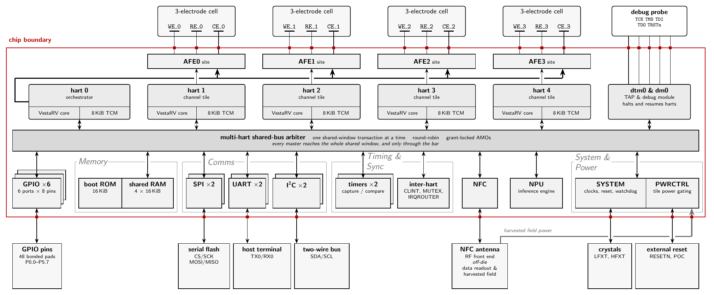

# VestaRV MCU

This directory contains the RTL for the complete VestaRV MCU system — the processor core, all peripherals, top-level integration, and shared components.

---

## Building and testing with Bazel

Bazel is the recommended way to build and exercise this RTL. It provisions
GHDL, the RISC-V cross compiler and Python itself, so nothing below needs a
local install. Every command is run from the repo root.

One-time bootstrap:

```sh
sh tools/get_bazel.sh            # fetches bazelisk into tools/bin/bazel
tools/bin/bazel test //...       # first run downloads all toolchains
```

Targets that cover this directory:

| Target | Verb | What it proves |
|---|---|---|
| `//hdl:vhdl_sources` | build | every tracked VHDL file under `hdl/`, including this tree, is a declared build input |
| `//hdl/common/tb:tb_vhdl_sources` | build | the `tb/` sources, re-exported so the `//hdl` glob does not lose them |
| `//hdl/common/tb:mp_arbiter_tb` | test | `mp_arbiter.vhd` under four synthetic masters contending for one shared single-port RAM |
| `//hdl/common/tb:pmp_unit_tb` | test | `vesta/pmp_unit.vhd` in all three generic shapes (PMP on with 16 and 8 entries, PMP off) in one run |
| `//hdl/common/tb:fpu_vectors_format_test` | test | the FPU reference-vector generator is deterministic and emits the record format `fpu_tb.vhd` parses |
| `//opensource_sim:isa_regression` | test | the core in `vesta/` passes all nine GHDL ISA suites; single images rerun on their own, e.g. `//opensource_sim/isa:rv32ui-p-add` |
| `//platform/common:check_mcu_vhd_test` | test | the tracked `MCU.vhd` is byte-identical to what the generator emits today |
| `//platform/common:check_memorymap_vhd_test` | test | the same for the generated `MemoryMap.vhd` |
| `//tools/python:check_entity_defaults_test` | test | the entity-generic defaults in `vesta/vesta.vhd` and `hart_tile.vhd` still agree with the generator and `MemoryMap.vhd` |
| `//tools:check_tracer_independence_test` | test | `vesta_tracer.vhd` still derives retire from its own logic |

`MCU.vhd` and `MemoryMap.vhd` here are generated, never hand-edited. The
hermetic regeneration is `tools/bin/bazel build
//platform/common:chip_artifacts_castalia`; never run `bazel run //:generate`,
which is the raw generator and writes wherever it happens to run.

The full target map is in [`BAZEL.md`](../../BAZEL.md).

---

## Architecture Overview

Below is the Castalia configuration of this RTL — five harts on one shared-window arbiter, with the peripheral set on a single rank beneath it. Every block in it is a source file in this directory. The figure is generated from the chip configuration (Figure 2 of the [Castalia TRM](../../implementations/asic/castalia/docs/TRM.pdf)); other configurations drop or repeat blocks.



### Memory Map

The memory map is configurable and varies between implementations. The general layout order is:

| Region | Description |
|--------|-------------|
| ROM | Boot ROM — holds the bootloader and initial program |
| Peripheral I/O | Memory-mapped peripheral registers, one slot per peripheral |
| RAM | Data RAM — program stack and heap |
| Interrupt Vectors | IRQ vector table, located within or just above RAM |
| SPI Flash window | Optional native SPI flash read window for XIP execution |

See the implementation-specific READMEs (e.g., [`implementations/asic/myshkin-2025-11/README.md`](../../implementations/asic/myshkin-2025-11/README.md)) for concrete address values.

---

## Processor Core — `vesta/`

The **VestaRV** core is a single-issue, in-order, multicycle RISC-V processor implemented as a finite-state-machine datapath. It is not pipelined in the classical sense; each instruction executes through a fetch→decode→execute→writeback cycle controlled by a single FSM in `controller.vhd`.

### Key Microarchitecture Features

| Feature | Detail |
|---------|--------|
| ISA | RV32I + M + C + A + ZBA + ZBB + ZBC + ZBS |
| Privilege levels | Machine mode (M) |
| Multiplier | Fast (single-cycle) 32×32 hardware multiplier |
| Divider | Multi-cycle hardware divider |
| Compressed ISA (C) | Split-fetch handler for 16-bit instructions at 4-byte-aligned boundaries |
| Atomics (A) | LR/SC and AMO instructions |
| Interrupts | Stack-based recursive interrupt controller — priority-encoded, re-entrant; the vector count is set by the `NUM_IRQS` generic (121 in the Castalia configuration) |
| Context switching | Software-managed (standard ABI register save/restore) |
| Clock gating | Core-wide CPU clock gate (`cg_clk_cpu`) — the whole core freezes on a memory stall, on the external `sleep` pin, and in `SLEEPING`; per-register-bank gating is tool-inserted at synthesis |

### Core Source Files

| File | Description |
|------|-------------|
| `vesta.vhd` | Top-level core entity; instantiates datapath and controller |
| `datapath.vhd` | Register file, ALU mux, PC logic, memory interface |
| `controller.vhd` | Main FSM — fetch, decode, execute, writeback, interrupt handling |
| `alu.vhd` | Arithmetic-logic unit (RV32IMACZB*) |
| `aludec.vhd` | ALU control decoder |
| `maindec.vhd` | Main instruction decoder |
| `irq_handler.vhd` | Interrupt priority encoder and stack-based context controller |
| `csr_unit.vhd` | Control and Status Register file (machine-mode) |
| `regfile.vhd` | 32×32-bit integer register file |
| `regfile_firq.vhd` | Fast-IRQ shadow register file variant |
| `regfile_sbirq.vhd` | Stack-based IRQ register file variant |
| `c_dec.vhd` | RVC compressed instruction decoder (expands 16-bit → 32-bit) |
| `div.vhd` | Multi-cycle integer divider |
| `extend.vhd` | Sign/zero extension unit |
| `loadext.vhd` | Load data alignment and extension |
| `store_ext.vhd` | Store data alignment |
| `branch_valid.vhd` | Branch condition evaluator |
| `pulse_extender.vhd` | One-shot pulse generation utility |

---

## Peripheral Modules — `periph/`

All peripherals share a common memory-mapped register interface: 32-bit word-addressed registers, byte-enable writes, synchronous reads. Interrupt lines feed the core's `irq_vector` input.

| Module | File | Description |
|--------|------|-------------|
| **GPIO** | `GPIO.vhd` | 8-bit bidirectional port with direction, pull-enable, and alternate function mux |
| **SPI** | `SPI.vhd` | SPI master with configurable clock polarity/phase and optional SPI-flash extension |
| **UART** | `UART.vhd` | Full-duplex UART with configurable baud rate |
| **I2C** | `I2C.vhd` | I2C master controller |
| **TIMER** | `TIMER.vhd` | 32-bit timer/counter with capture, compare, and PWM |
| **SYSTEM** | `SYSTEM.vhd` | System control: clock mux/divider, DCO trim, watchdog, CRC engine, power gating |
| **NPU** | `NPU.vhd` | Hardware neural network accelerator (fixed-point MAC array) |


For full register-level documentation of each peripheral, see the **Technical Reference Manual (TRM)** PDF at [`implementations/asic/myshkin-2025-11/docs/TRM.pdf`](../../implementations/asic/myshkin-2025-11/docs/TRM.pdf).

---

## Shared Components — `commune/`

Components in this directory are used by multiple modules across the design.

| Component | Description |
|-----------|-------------|
| `ClkGate` | Clock-gate cell — use this instead of combinatorial enables on clocks |
| `ClkDivPower2` | Divide-by-2ⁿ clock divider |
| `ClockMuxGlitchFree` | Glitch-free two-input clock multiplexer |
| `CRC16` | CRC-16/CCITT engine |
| `Synchronizer` | 2-FF CDC synchronizer for single-bit signals |
| `SynchronizerSLV` | CDC synchronizer for std_logic_vector |
| `GlitchFilter_behav` | Majority-vote glitch filter for pad inputs |
| `FPMac` | IEEE 754 single-precision multiply-accumulate (used by NPU) |
| `FPSigmoid` | Piecewise-linear sigmoid approximation (used by NPU) |
| `fixed_pkg_c.vhdl` | VHDL fixed-point arithmetic package |
| `macros.vhd` | Package containing common conversions |

---

## Top-Level Integration — `MCU.vhd`

`MCU.vhd` wires together:
- The VestaRV core
- Generic ROM and SRAM instances 
- All peripheral instances
- The address decoder (`adddec.vhd`)
- Pad cells (for ASIC implementation)
- Clock and reset distribution
- IRQ aggregation

The port list of `MCU` directly maps to physical chip pads and is the entry point for both FPGA and testbench instantiation.

---

## `MemoryMap.vhd` 

`MemoryMap.vhd` contains peripheral base addresses and register slot address constants.
