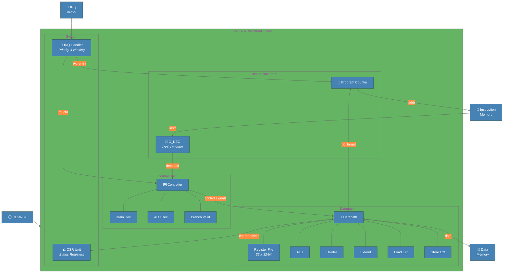
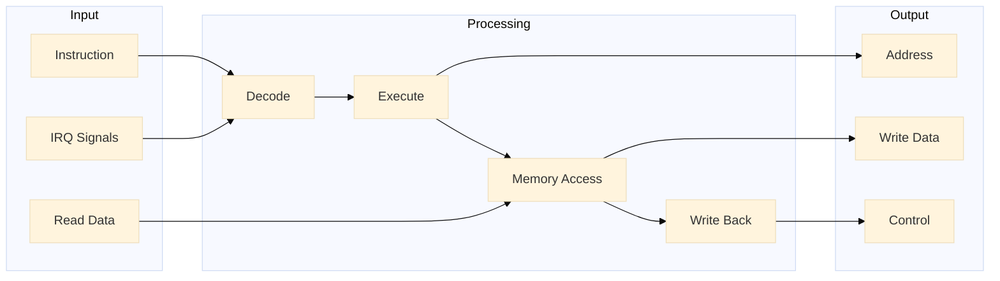
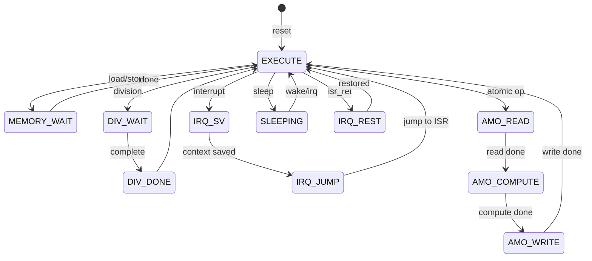

# VESTA RV32IMAC Core - Block Diagram (Mermaid)

This is a simpler alternative that can be rendered in GitHub, VS Code, or Mermaid Live Editor.

## High-Level Architecture

## Data Flow Diagram

## State Machine Overview

## ISA Extensions

| Extension | Full Name | Description |
|:---------:|-----------|-------------|
| **I** | Base Integer | Load, store, arithmetic, branches |
| **M** | Multiply | MUL, MULH, DIV, REM |
| **A** | Atomic | LR, SC, AMO operations |
| **C** | Compressed | 16-bit instruction encoding |
| **Zicsr** | CSR | Control/Status Registers |

---

*Render this file with any Mermaid-compatible viewer*
